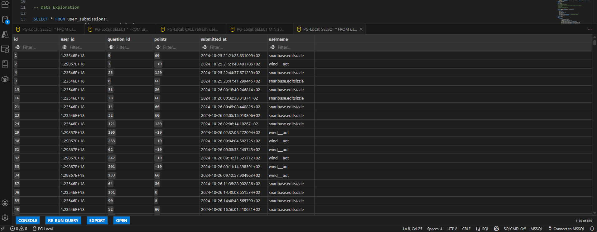

# SQL Analytics Projects

This repository contains **three SQL projects** that analyze datasets from a gamified learning environment, Spotify, and Netflix. Each project uses **single-table datasets** and focuses on querying, aggregating, and deriving insights using PostgreSQL.

---

## Projects Overview

### 1. Gamified Learning Project

**Goal:** Analyze user submissions and performance in a gamified learning platform.  
**What I did:** Created tables, aggregated user metrics, applied window functions for ranking and running totals, implemented stored functions for per-user summaries, and automated performance snapshots with stored procedures.

### 2. Spotify Project

**Goal:** Explore Spotify track and album data to identify trends in engagement and performance.  
**What I did:** Aggregated streams, likes, and comments; ranked tracks and artists; calculated engagement ratios; used window functions for analytics; created a function to classify engagement tiers and a procedure to update ratios automatically.

### 3. Netflix Project

**Goal:** Analyze movies and TV shows metadata for trends in genres, ratings, countries, and actors.  
**What I did:** Aggregated content by type, genre, and country; explored trends over time; counted and ranked actors, directors, and productions; created functions for content analysis and recommendations based on keywords, ratings, and release years.

---

## Features Across Projects

- Aggregation queries for totals, averages, and rankings  
- Window functions for running totals, ranking, and analytics  
- SQL functions to automate repetitive calculations or classify data  
- Stored procedures to update or snapshot metrics automatically  

---

