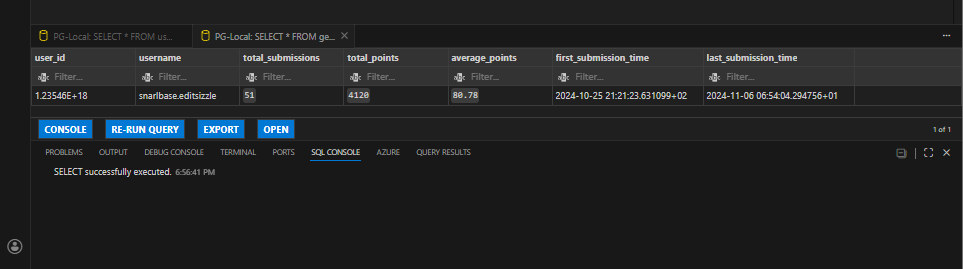
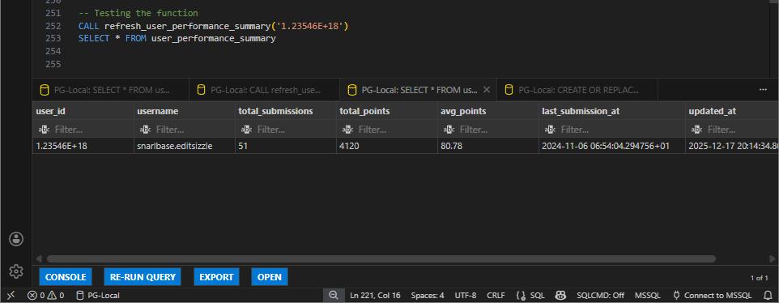

# SQL Mentor Project – User Submissions Analytics

### Project Description
This project analyzes a dataset of user submissions in a gamified learning platform, tracking points earned per question and submission timing. It includes database setup, exploration queries, user-level analytics, running totals, ranking, daily and weekly performance summaries, and automated performance snapshots using functions and stored procedures. The repository provides a complete workflow for monitoring, summarizing, and reporting user performance over time.


---

## Table of Contents

1. [Project Setup](#project-setup)  
2. [Data Exploration](#data-exploration)  
3. [Analytics Tasks](#analytics-tasks)  
    - [Task 1: User Stats](#task-1-user-stats)  
    - [Task 2: Daily Average Points](#task-2-daily-average-points)  
    - [Task 3: Top 3 Accurate Users Per Day](#task-3-top-3-accurate-users-per-day)  
    - [Task 4: Top 5 Users by Submission Types](#task-4-top-5-users-by-submission-types)  
    - [Task 5: Weekly Top 10 Performers](#task-5-weekly-top-10-performers)  
    - [Task 6: User Performance Summary Function](#task-6-user-performance-summary-function)  
    - [Task 7: Submission Analytics Function (Window Functions)](#task-7-submission-analytics-function-window-functions)  
    - [Task 8: Stored Procedure for Performance Snapshot](#task-8-stored-procedure-for-performance-snapshot)  

---

## Project Setup

```sql
-- Drop and create the main table
DROP TABLE IF EXISTS user_submissions;

CREATE TABLE user_submissions (
    id SERIAL PRIMARY KEY,
    user_id TEXT,
    question_id INT,
    points INT,
    submitted_at TIMESTAMP WITH TIME ZONE,
    username VARCHAR(50)
);
```
## Data Exploration
```sql
SELECT * FROM user_submissions;
SELECT DISTINCT user_id FROM user_submissions;
SELECT DISTINCT username FROM user_submissions;
SELECT 
	MIN(submitted_at) AS first_submission,
	MAX(submitted_at) AS last_submission
 FROM user_submissions; 
```
## Analytics Tasks
### Task1: User Stats 
Listing All Distinct Users and Their Stats (returning usernames, total submissions and points earned)

```sql
SELECT 
    username,
    COUNT(*) AS total_submissions,
    SUM(points) AS total_points
FROM user_submissions
GROUP BY 1
ORDER BY 2 DESC, 3 DESC;
```
### Task 2: Daily Average Points
Calculating daily average points for each user

```sql
SELECT 
    username,
    TO_CHAR(submitted_at, 'DD-MM') AS day,
    ROUND(AVG(points),2) as average_points
FROM user_submissions
GROUP BY 1,2
ORDER BY 3 DESC
LIMIT 10;
```

### Task 3: Top 3 Accurate Users Per Day
Finding the top 3 users with the most accurate submissions for each day.

```sql
SELECT * FROM
(
SELECT
    username,
    SUM(points) AS total_points,
    TO_CHAR(submitted_at, 'DD-MM') AS day, 
    ROW_NUMBER() OVER(PARTITION BY TO_CHAR(submitted_at, 'DD-MM') ORDER BY SUM(points) DESC) AS rank
FROM user_submissions
GROUP BY 1,3
) AS t1
WHERE rank <=3
```
**Alternative approach**: rank by number of correct submissions.

```sql
WITH cte1 as
(
SELECT 
    username,
    TO_CHAR(submitted_at, 'DD-MM') AS day, 
    SUM(CASE WHEN points>0 THEN 1 ELSE 0 END) AS correct_submissions
FROM user_submissions
GROUP BY 1,2
)
SELECT * FROM
(
SELECT 
    *,
    ROW_NUMBER() OVER(PARTITION BY day ORDER BY correct_submissions DESC) AS rank
FROM cte1
) AS t1
WHERE rank <=3;
-- the first version is more accurate
```
### Task 4: Top 5 Users by Submission Types
Finding the top 5 users with the highest number of incorrect submissions, correct submissions, total points

```sql
SELECT 
    username,
    SUM(CASE WHEN points<0 THEN 1 ELSE 0 END) AS incorrect_submissions,
    SUM(CASE WHEN points>0 THEN 1 ELSE 0 END) AS correct_submissions,
    SUM(CASE WHEN points>0 THEN points ELSE 0 END) AS points_added,
    SUM(CASE WHEN points<0 THEN points ELSE 0 END) AS points_lost,
    sum(points) as total_points
FROM user_submissions
GROUP BY 1
ORDER BY 2 DESC LIMIT 5
```
### Task 5: Weekly Top 10 Performers
Finding the top10 performers for each week (based on their points)

```sql
SELECT * FROM
(
    SELECT 
    username,
    EXTRACT(WEEK FROM submitted_at) as week_number, -- 52 weeks in total for year
    SUM(points) as total_points,
    ROW_NUMBER() OVER(PARTITION BY EXTRACT(WEEK FROM submitted_at) ORDER BY SUM(points) DESC ) AS rank
FROM user_submissions
GROUP BY 1,2
) AS subq
WHERE rank<=10
```
### Task 6: User Performance Summary Function
User performance summary
This function will return a per-user performance summary which will higlight:
- total submissions
- total points
- average points per submission
- first and last submission time

```sql
CREATE OR REPLACE FUNCTION get_ups (p_user_id TEXT)
RETURNS TABLE 
(
    user_id TEXT,
    username VARCHAR,
    total_submissions INT,
    total_points INT,
    average_points FLOAT,
    first_submission_time TIMESTAMPTZ,  --timestamp with TimeZone
    last_submission_time TIMESTAMPTZ
)
LANGUAGE plpgsql
AS $$
BEGIN
    RETURN QUERY
        SELECT
            user_submissions.user_id,
            user_submissions.username,
            COUNT(*)::INT AS total_submissions,
            SUM(user_submissions.points)::INT AS total_points,
            ROUND(AVG(user_submissions.points),2)::FLOAT AS average_points,
            MIN(user_submissions.submitted_at) AS first_submission_time,
            MAX(user_submissions.submitted_at) AS last_submission_time
        FROM user_submissions
        WHERE user_submissions.user_id = p_user_id
        GROUP BY 1,2;  --semicolon before end is very important
END;
$$;

-- Testing the function
SELECT * FROM get_ups ('1.23546E+18')

```
### Task 7: Submission Analytics Function (Window Functions)
For a given user, returning each submission highlighting :
- running total of points
- running average of points
- submission rank by time
- time since previous submission

```sql
CREATE OR REPLACE FUNCTION get_user_submission_analytics (p_user_id TEXT)
RETURNS TABLE
(
    user_id TEXT,
    username VARCHAR,
    submission_number BIGINT,
    total_running_points BIGINT,
    avg_running_points NUMERIC,
    minutes_since_last_submission BIGINT
)
LANGUAGE plpgsql
AS $$
BEGIN
    RETURN QUERY
        SELECT
            user_submissions.user_id,
            user_submissions.username,
            ROW_NUMBER() 
            OVER(
                PARTITION BY user_submissions.user_id 
                ORDER BY user_submissions.submitted_at
                )::BIGINT AS submission_number ,
            SUM(user_submissions.points) 
            OVER(
                PARTITION BY user_submissions.user_id 
                ORDER BY user_submissions.submitted_at
                ROWS BETWEEN UNBOUNDED PRECEDING AND CURRENT ROW  --usually used for running totals or cumulative calculations
                )::BIGINT AS total_running_points,
            ROUND(AVG(user_submissions.points)
            OVER(
                PARTITION BY user_submissions.user_id 
                ORDER BY user_submissions.submitted_at
                ROWS BETWEEN UNBOUNDED PRECEDING AND CURRENT ROW 
                )::NUMERIC,2) AS avg_running_points,
            (EXTRACT(EPOCH FROM( -- epoch extracts seconds from the output interval of the subtraction
                user_submissions.submitted_at
                - LAG(user_submissions.submitted_at) -- lag looks at the previous row within a window, and calculates the difference in seconds
            OVER(
                PARTITION BY user_submissions.user_id
                ORDER BY user_submissions.submitted_at
                )
            ))/60)::BIGINT AS minutes_since_last_submission --dividing by 60 and turning seconds into minutes
        FROM user_submissions
        WHERE user_submissions.user_id = p_user_id;
        -- no group by needed because window functions operate on rows not grouped result-no aggregation
END;
$$;

-- Testing the function
SELECT * FROM get_user_submission_analytics ('1.23546E+18')        
```


### Task 8: Stored Procedure for Performance Snapshot
Calculating and storing a user’s performance snapshot
- Deleting any old snapshot
- Computing total submissions, points and average points using window / aggregate logic
- Inserting a fresh summary row  */

-- In order to store the user's performance snapshot I will create a new table 

```sql
CREATE TABLE IF NOT EXISTS user_performance_summary (
    user_id TEXT PRIMARY KEY,
    username VARCHAR(50),
    total_submissions BIGINT,
    total_points BIGINT,
    avg_points NUMERIC(6,2),
    last_submission_at TIMESTAMPTZ,
    updated_at TIMESTAMPTZ DEFAULT NOW() -- default with the keyword NOW
);

CREATE OR REPLACE PROCEDURE refresh_user_performance_summary(p_user_id TEXT)
LANGUAGE plpgsql
AS $$
BEGIN
     IF NOT EXISTS (
        SELECT 1
        FROM user_submissions
        WHERE user_id = p_user_id
    ) THEN
            RAISE NOTICE '% does not exist. Please try again', p_user_id;
            RETURN;
        END IF;

    -- Removing old snapshot if it exists
    DELETE FROM user_performance_summary
    WHERE user_id = p_user_id;

    -- Inserting refreshed analytics
    INSERT INTO user_performance_summary(
        user_id,
        username,
        total_submissions,
        total_points,
        avg_points,
        last_submission_at
    )
    SELECT
        user_submissions.user_id,
        user_submissions.username,
        COUNT(*) AS total_submissions,
        SUM(points) AS total_points,
        AVG(points) AS avg_points,
        MAX(user_submissions.submitted_at) AS last_submission_at
    FROM user_submissions
    WHERE user_submissions.user_id = p_user_id
    GROUP BY 1,2;

        RAISE NOTICE 'Performance summary successfully refreshed for % ', p_user_id;
END;
$$;
```
```sql
-- Testing the function
CALL refresh_user_performance_summary('1.23546E+18')
SELECT * FROM user_performance_summary
```


```sql
-- Testing the function with an user id that does not exist
CALL refresh_user_performance_summary('2.23546E+18')
```


In this project I created tables to store user submissions, performed aggregations and ranking queries, used window functions for running totals and analytics, built stored functions for per-user summaries, and implemented stored procedures to automate performance snapshots.


